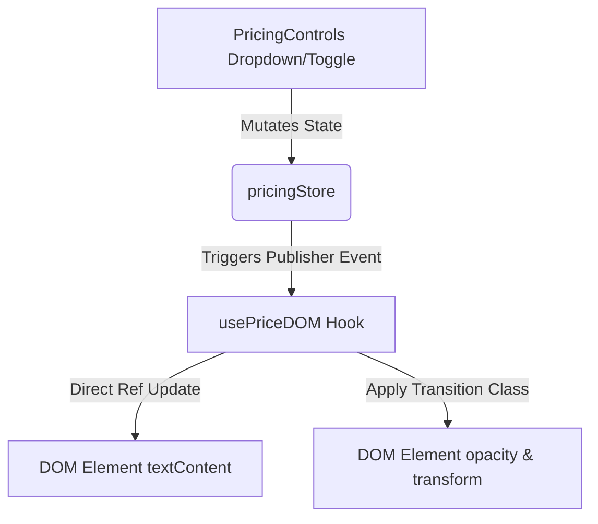

# NeuroFlow AI ── Data Automation Platform

<p align="left">
  
  
  
  
  
</p>

NeuroFlow AI is a high-performance, responsive enterprise SaaS landing page demonstrating a next-generation autonomous AI data orchestration engine. Built specifically for frontend engineering evaluation, this repository implements professional visual depth, fluid micro-interactions, and strict performance limits.

---

## 💎 Core Features

* **Dynamic Pricing Engine**: A multi-dimensional pricing matrix supporting USD (`$`), EUR (`€`), and INR (`₹`) currencies alongside billing frequency selection.
* **Performance-Isolated DOM Binding**: An isolated price-binding architecture that performs targeted text node updates directly in the DOM, guaranteeing zero React component render loops when changing billing rates.
* **Bento Grid Layout**: A clean, balanced structural display showcasing system features with Top-Border highlights and interactive hardware-simulation panels.
* **Accordion Transformation**: Automatically refactors the Bento grid layout on mobile screens into collapsible nodes with clean CSS transitions and state persistence.
* **AI Execution Canvas**: A live SVG layout tracing connections from stream sources through the core orchestrator node to dispatch channels with continuous CSS dash-flow packet movements.
* **Telemetry Observation Console**: Real-time cluster observability feeds displaying transaction loads, status indicators, and logging feeds.
* **Responsive Architecture**: Pixel-perfect viewports scaling smoothly across mobile (`320px`), tablet (`768px`), desktop (`1280px`), and ultra-wide screens (`1920px`) with zero overflows.

---

## 🛠 Technology Stack

* **React (v19)**: Component-driven interface building.
* **Vite (v8)**: Fast bundling and local dev server setup.
* **Tailwind CSS (v3)**: Utility-first, low-overhead design.
* **JavaScript (ES6+)**: Custom store bindings and DOM manipulation.
* **CSS Keyframes**: Performant, hardware-composited animations.
* **SVG**: Crisp icons and network vector graphics.
* **HTML5**: Structured semantic outline layout.

---

## ⚡ Architecture & State Isolation

NeuroFlow AI utilizes a custom, lightweight pub-sub pattern to manage pricing values, bypassing standard React lifecycle triggers for selected DOM nodes to protect performance scores.



### Key Architectural Elements
1. **Pricing Store (`src/pricing/pricingStore.js`)**: A plain JavaScript publisher-subscriber store that holds current currency and billing selections.
2. **Targeted Binding Hook (`src/hooks/usePriceDOM.js`)**: Subscribes directly to state changes and uses React `useRef` binds to update nodes directly. This isolates pricing card inputs, completely avoiding Virtual DOM updates on the remainder of the page.
3. **Responsive State Syncing (`src/components/Features.jsx`)**: Preserves active index values across device resizes. If a node is active on desktop, the equivalent accordion pane automatically loads expanded when sizing to mobile viewports.

---

## 📂 Directory Layout

```
Neuroflow-AI/
├── public/
│   ├── favicon.svg          # Platform logo icon asset
│   ├── icons.svg            # Decoupled SVG spritesheet
│   └── robots.txt           # SEO search engine rules
├── src/
│   ├── assets/              # Static vector illustrations
│   ├── components/          # Structural UI components
│   │   ├── Dashboard.jsx    # Telemetry and logging console
│   │   ├── Features.jsx     # Responsive Bento grid and mobile accordion
│   │   ├── Footer.jsx       # Global build details and brand links
│   │   ├── Hero.jsx         # Header title and visual connection grids
│   │   ├── Navbar.jsx       # Scroll-compact navigation and active indicators
│   │   ├── Pricing.jsx      # Feature cards grid
│   │   ├── Testimonials.jsx # Trust metrics and author review cards
│   │   └── Workflow.jsx     # AI canvas animation network
│   ├── data/                # Decoupled text config variables
│   ├── hooks/               # Performance isolation hooks
│   ├── pricing/             # Multi-dimensional calculation models
│   ├── App.jsx              # Application component orchestrator
│   ├── index.css            # Base tailwind layer and animation keyframes
│   └── main.jsx             # React framework bootstrap index
├── index.html               # Semantic SEO template header
├── tailwind.config.js       # Design tokens and custom theme mappings
└── package.json             # Build script configuration files
```

---

## 🚀 Installation & Setup

### Prerequisites
Make sure you have Node.js (v18+) and npm installed.

### 1. Install Dependencies
Install all package configurations:
```bash
npm install
```

### 2. Launch Local Dev Server
Runs the local development environment:
```bash
npm run dev
```

### 3. Compile Production Bundle
Builds optimized, compressed HTML, CSS, and JS assets to the `/dist` directory:
```bash
npm run build
```

### 4. Code Quality & Linting
Run oxlint to inspect syntax:
```bash
npm run lint
```

---

## 📈 Performance & Design Polish

* **Composited CSS Transitions**: Transitions (translucencies, colors, scaling, translations) are handled by the browser's hardware-accelerated compositor thread, protecting interaction responsiveness.
* **Compact Headers**: The navigation bar dynamically reduces padding and height when page scroll offsets exceed `20px`.
* **Tactile Texture**: Injected a low-opacity CSS-turbulence noise overlay to create subtle background depth and grain.
* **Palette Strictness**: Colors are locked strictly to the custom palette (`#172B36`, `#114C5A`, `#F1F6F4`, `#D9E8E2`, `#FFC801`, `#FF9932`).

---

## ♿ Accessibility (A11y) & SEO

* **Semantic Hierarchy**: Structured HTML layout utilizing single `<h1>` headers, `<header>`, `<main>`, `<section>`, and `<footer>` containers.
* **Aria Attributes**: All interactive collapsible elements include programmatically assigned `aria-expanded` and `aria-controls` properties.
* **Focus States**: Navigation items, custom inputs, and button structures feature visible focus rings to support assistive technologies.
* **Search Engine Optimizations**: Full meta tags, Twitter cards, Open Graph tags, robots config files, and viewport optimizations are configured in `index.html`.

---

## 🔮 Future Roadmap

* **Theme Customization**: Dark/Light mode color switching.
* **Authentication Modules**: Integrate mock login sessions.
* **Real-time API Bindings**: Hook up telemetry dials to live WebSockets.
* **Internationalization**: Support multi-language routing tags.
* **PWA Capability**: Support offline caching profiles.

---

## 📄 License

This project is created for evaluation purposes. Add an appropriate license declaration before utilizing or deploying for open-source distribution.

---

## 👥 Authors

Built with care for the **Frontend Battle Phase 1** competition.
